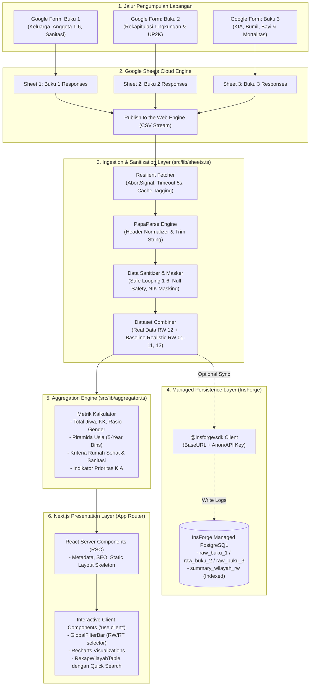

# Software Architecture & Data Pipeline
## Resilient Architecture & High-Performance Data Pipeline – Dasawisma Bubulak

- **ID Dokumen:** ARCH-PKK-BBL-2026-02
- **Versi:** 2.0.0 (Enterprise-Ready & Fault-Tolerant)
- **Status:** Approved for Execution
- **Tech Stack Inti:** Next.js 16 (App Router, TypeScript 5), InsForge Managed BaaS (PostgreSQL 15), Recharts, PapaParse, Tailwind CSS

---

## 1. Diagram Arsitektur & Alur Data Terpadu

Sistem mengadopsi pola **Hybrid Ingestion & Cached Aggregation Pipeline**. Jalur pengumpulan data kader terpisah dari jalur penyajian eksekutif guna mencegah kendala bottleneck dan memastikan keandalan tinggi.



---

## 2. Batas Arsitektur Next.js App Router (RSC vs Client Components)

Untuk mencapai target LCP < 1.2 detik dan ukuran bundel JavaScript awal yang minimal, batasan antara Server Components dan Client Components dipisahkan secara disiplin:

| Layer Komponen | Jenis Komponen | Alasan Pemilihan & Tanggung Jawab |
|---|---|---|
| `src/app/layout.tsx` | **Server Component** | Injeksi font Plus Jakarta Sans, konfigurasi metadata OpenGraph resmi Pemkot Bogor / TP-PKK, zero JS footprint di browser. |
| `src/app/page.tsx` | **Server Component** | Orchestrator data. Memanggil data pipeline dan baseline dataset secara langsung di server node, merender kerangka dokumen, lalu mengoper data matang ke komponen presentasi. |
| `HeaderExecutive.tsx` | **Server Component** | Menampilkan identitas resmi, logo lambang PKK, dan subtitle statis. |
| `StatCards.tsx` | **Server Component** | Merender 4 kartu indikator utama secara instan tanpa rehidrasi JavaScript yang berat. |
| `GlobalFilterBar.tsx` | **Client Component (`'use client'`)** | Menangani state interaktif filter dropdown wilayah (`selectedRW`, `selectedRT`), tombol reset, dan event handler navigasi instan. |
| Komponen Grafik Recharts | **Client Component (`'use client'`)** | Recharts membutuhkan akses DOM (`window`, SVG measurement, mouse hover event untuk Tooltip). Seluruh chart dibungkus rapi dalam client boundary mandiri. |
| `RekapWilayahTable.tsx` | **Client Component (`'use client'`)** | Fitur pencarian instan nama RW/RT, sortir kolom, dan penyorotan baris terpilih tanpa melakukan refresh halaman. |

---

## 3. Strategi Transformasi Data & Fault-Tolerance

### 3.1 Normalisasi Looping 70+ Kolom Buku 1
Formulir Buku 1 memiliki struktur datar (*flat columns*) lebih dari 70 kolom karena menampung data individu anggota 1 hingga 6:
```
[Timestamp, Nama Pengisi, No KK, ..., Nama Anggota 1, Status Anggota 1, Tgl Lahir 1, ..., Nama Anggota 6, Status Anggota 6, Tgl Lahir 6, ...]
```
**Algoritma Looping Aman (Safe Looper):**
1. Parser membaca prefix kolom pola regex: `/^nama_anggota_(\d+)$/i`.
2. Jika atribut nama anggota kosong, bernilai strip (`-`), atau spasi kosong, loop menghentikan evaluasi untuk anggota tersebut tanpa memicu runtime error.
3. Menghitung usia otomatis secara dinamis dari string tanggal lahir (`YYYY-MM-DD` atau `DD/MM/YYYY`) dengan fallback jika tanggal tidak valid.
4. Menghasilkan larik terstruktur `CitizenEntity[]` yang siap dimasukkan ke kalkulator piramida usia.

### 3.2 Strategi Fallback Dataset Baseline (13 RW Realistis)
Saat implementasi lapangan tanggal 17–19 September 2026, pengisian Google Forms terkonsentrasi pada **RW 12 (wilayah pilot percontohan)**.
Untuk menjamin dashboard menyajikan visualisasi makro yang utuh di hadapan Ibu Lurah:
1. **Penyatuan Dinamis (Dynamic Union):** Sistem memuat baseline dataset realistis 13 RW Bubulak (`src/data/baselineBubulak.ts`) yang disusun berdasarkan data agregat resmi kelurahan sebelumnya.
2. **Prioritas Data Riil:** Ketika respons Google Sheets RW 12 berhasil ditarik, pipeline secara otomatis menimpa baris RW 12 di baseline dengan kalkulasi data riil terkini.
3. **Penanda Khusus (Audit Trail):** RW 12 diberi atribut `is_pilot: true` dan badge hijau di seluruh tabel dan grafik guna membedakan data uji coba riil dengan data proyeksi baseline.

---

## 4. Pola Akses InsForge BaaS

### 4.1 Inisialisasi Klien Singleton (`src/lib/insforge.ts`)
```typescript
import { createClient } from '@insforge/sdk';

const baseUrl = process.env.NEXT_PUBLIC_INSFORGE_BASE_URL || 'https://r6nu44ke.ap-southeast.insforge.app';
const anonKey = process.env.NEXT_PUBLIC_INSFORGE_ANON_KEY || 'anon_deccc4a346bc934f34f56f155af945b2409c6f989fae0680e453db725b5208d5';

export const insforge = createClient({
  baseUrl,
  anonKey,
});
```

### 4.2 Strategi Cache & Sinkronisasi
- **Read Path (Penyajian Dashboard):** Data agregat dibaca langsung dari memori server/RSC atau tabel `summary_wilayah_rw` di InsForge untuk menjamin waktu respon di bawah 200 ms.
- **Write Path (Sinkronisasi CSV):** Endpoint API Route `src/app/api/sync/route.ts` memicu penarikan CSV terbaru, sanitasi data, lalu melakukan operasi `upsert` ke PostgreSQL InsForge.

---

## 5. Standar Struktur Direktori Modular

```
dasawisma-bubulak/
├── docs/                             # Dokumentasi Arsitektur & Spesifikasi
│   ├── 01_PRD.md
│   ├── 02_ARCHITECTURE.md
│   ├── 03_DATA_MODEL_AND_ERD.md
│   ├── 04_UI_AND_CHARTS_SPEC.md
│   └── 05_ROADMAP.md
├── public/
│   ├── assets/                       # Logo resmi PKK & Pemkot Bogor
│   └── mock/                         # CSV cadangan offline untuk simulasi
├── src/
│   ├── app/                          # Next.js App Router Core
│   │   ├── layout.tsx                # Server Component: Shell & Metadata
│   │   ├── page.tsx                  # Server Component: Orchestrator Data
│   │   ├── globals.css               # Design Tokens & Reset CSS
│   │   └── api/
│   │       └── sync/route.ts         # Ingestion Webhook / Sync Handler
│   ├── components/
│   │   ├── dashboard/                # Komponen Spesifik Domain Dasawisma
│   │   │   ├── HeaderExecutive.tsx   # Header resmi & tombol sinkronisasi
│   │   │   ├── StatCards.tsx         # 4 Kartu KPI makro utama
│   │   │   ├── GlobalFilterBar.tsx   # Filter RW/RT interaktif ('use client')
│   │   │   ├── RWComparisonChart.tsx # Grouped Bar Chart komparasi 13 RW
│   │   │   ├── DemographicsChart.tsx # Piramida usia simetris L/P
│   │   │   ├── EducationJobChart.tsx # Horizontal bar pendidikan & pekerjaan
│   │   │   ├── SanitationSection.tsx # Donut & progress indikator sanitasi
│   │   │   ├── KiaSection.tsx        # Kartu pemantauan bumil, bayi & akta
│   │   │   └── RekapWilayahTable.tsx # Tabel 13 RW + Grand Total ('use client')
│   │   └── ui/                       # Reusable UI Primitives
│   │       ├── Card.tsx              # Surface container berstandar kontras
│   │       ├── Badge.tsx             # Indikator status & pill penanda
│   │       └── Skeleton.tsx          # Shimmer loading state
│   ├── lib/
│   │   ├── insforge.ts               # Inisialisasi SDK InsForge BaaS
│   │   ├── sheets.ts                 # Fetcher & PapaParse Ingestion Engine
│   │   ├── sanitizer.ts              # Normalisasi loop 1-6 & NIK masker
│   │   └── aggregator.ts             # Logika kalkulasi metrik & piramida usia
│   ├── types/
│   │   └── dasawisma.ts              # Strict TypeScript Types & Interfaces
│   └── data/
│       ├── wilayah.ts                # Metadata baku 13 RW & 50 RT Bubulak
│       └── baselineBubulak.ts        # Dataset acuan simulasi realistis 13 RW
```
