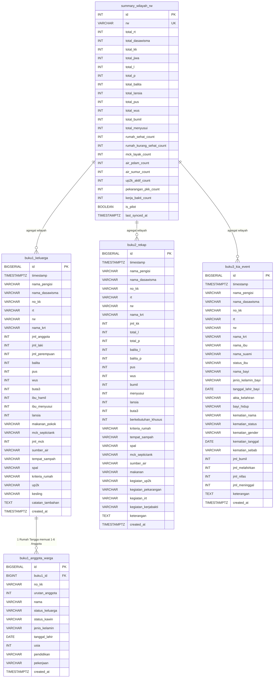

# Strict Data Model, Schemas & TypeScript Types
## Sistem Informasi & Dashboard Eksekutif Dasawisma TP-PKK Kelurahan Bubulak

- **ID Dokumen:** DATA-PKK-BBL-2026-03
- **Versi:** 2.0.0 (Strict Typing & Production Schemas)
- **Status:** Approved for Execution
- **Basis Data:** InsForge Managed PostgreSQL 15

---

## 1. Diagram Relasi Entitas (ERD Mermaid)

Struktur data didesain pragmatis guna memetakan respons Google Forms tanpa beban relasional yang berlebihan (*over-engineering*), namun memiliki integritas referensial kuat pada data anggota warga:



---

## 2. Skema DDL InsForge PostgreSQL (Teroptimasi Indeks)

```sql
-- =======================================================
-- 1. TABEL BUKU 1: KELUARGA & FASILITAS SANITASI RUMAH
-- =======================================================
CREATE TABLE IF NOT EXISTS buku1_keluarga (
    id BIGSERIAL PRIMARY KEY,
    timestamp TIMESTAMPTZ DEFAULT NOW(),
    nama_pengisi VARCHAR(100),
    nama_dasawisma VARCHAR(100) NOT NULL,
    no_kk VARCHAR(16) NOT NULL,
    rt VARCHAR(5) NOT NULL,
    rw VARCHAR(5) NOT NULL,
    nama_krt VARCHAR(150) NOT NULL,
    jml_anggota INT DEFAULT 0,
    jml_laki INT DEFAULT 0,
    jml_perempuan INT DEFAULT 0,
    balita INT DEFAULT 0,
    pus INT DEFAULT 0,
    wus INT DEFAULT 0,
    buta3 INT DEFAULT 0,
    ibu_hamil INT DEFAULT 0,
    ibu_menyusui INT DEFAULT 0,
    lansia INT DEFAULT 0,
    makanan_pokok VARCHAR(50) DEFAULT 'Beras',
    mck_septictank VARCHAR(50) DEFAULT 'Ada/Milik Sendiri',
    jml_mck INT DEFAULT 1,
    sumber_air VARCHAR(50) DEFAULT 'PDAM',
    tempat_sampah VARCHAR(50) DEFAULT 'Ada (Tertutup)',
    spal VARCHAR(50) DEFAULT 'Ada (Tertutup)',
    kriteria_rumah VARCHAR(50) DEFAULT 'Sehat',
    up2k VARCHAR(100),
    kesling VARCHAR(100),
    catatan_tambahan TEXT,
    created_at TIMESTAMPTZ DEFAULT NOW()
);

-- Indexing Kritis Pencarian & Agregasi
CREATE INDEX IF NOT EXISTS idx_buku1_rw_rt ON buku1_keluarga(rw, rt);
CREATE INDEX IF NOT EXISTS idx_buku1_no_kk ON buku1_keluarga(no_kk);
CREATE INDEX IF NOT EXISTS idx_buku1_created_at ON buku1_keluarga(created_at DESC);

-- =======================================================
-- 2. TABEL BUKU 1 DETAIL: ANGGOTA WARGA (HASIL LOOPING 1-6)
-- =======================================================
CREATE TABLE IF NOT EXISTS buku1_anggota_warga (
    id BIGSERIAL PRIMARY KEY,
    buku1_id BIGINT REFERENCES buku1_keluarga(id) ON DELETE CASCADE,
    no_kk VARCHAR(16) NOT NULL,
    urutan_anggota INT CHECK (urutan_anggota BETWEEN 1 AND 6),
    nama VARCHAR(150) NOT NULL,
    status_keluarga VARCHAR(50) NOT NULL, -- 'Kepala Keluarga', 'Istri', 'Anak', 'Famili Lain'
    status_kawin VARCHAR(50),             -- 'Kawin', 'Belum Kawin', 'Cerai Hidup', 'Cerai Mati'
    jenis_kelamin VARCHAR(10) NOT NULL,    -- 'L' / 'P'
    tanggal_lahir DATE,
    usia INT CHECK (usia >= 0 AND usia <= 130),
    pendidikan VARCHAR(50),               -- 'Tidak Sekolah', 'SD', 'SMP', 'SMA', 'D3', 'S1', 'S2'
    pekerjaan VARCHAR(100),               -- 'IRT', 'Karyawan Swasta', 'PNS', 'Wiraswasta', 'Pelajar'
    created_at TIMESTAMPTZ DEFAULT NOW()
);

CREATE INDEX IF NOT EXISTS idx_anggota_buku1_id ON buku1_anggota_warga(buku1_id);
CREATE INDEX IF NOT EXISTS idx_anggota_no_kk ON buku1_anggota_warga(no_kk);
CREATE INDEX IF NOT EXISTS idx_anggota_usia ON buku1_anggota_warga(usia);
CREATE INDEX IF NOT EXISTS idx_anggota_jk ON buku1_anggota_warga(jenis_kelamin);
CREATE INDEX IF NOT EXISTS idx_anggota_created_at ON buku1_anggota_warga(created_at DESC);

-- =======================================================
-- 3. TABEL BUKU 2: REKAPITULASI CATATAN & KEGIATAN WARGA
-- =======================================================
CREATE TABLE IF NOT EXISTS buku2_rekap (
    id BIGSERIAL PRIMARY KEY,
    timestamp TIMESTAMPTZ DEFAULT NOW(),
    nama_pengisi VARCHAR(100),
    nama_dasawisma VARCHAR(100),
    no_kk VARCHAR(16),
    rt VARCHAR(5) NOT NULL,
    rw VARCHAR(5) NOT NULL,
    nama_krt VARCHAR(150),
    jml_kk INT DEFAULT 1,
    total_l INT DEFAULT 0,
    total_p INT DEFAULT 0,
    balita_l INT DEFAULT 0,
    balita_p INT DEFAULT 0,
    pus INT DEFAULT 0,
    wus INT DEFAULT 0,
    bumil INT DEFAULT 0,
    menyusui INT DEFAULT 0,
    lansia INT DEFAULT 0,
    buta3 INT DEFAULT 0,
    berkebutuhan_khusus INT DEFAULT 0,
    kriteria_rumah VARCHAR(50),
    tempat_sampah VARCHAR(50),
    spal VARCHAR(50),
    mck_septictank VARCHAR(50),
    sumber_air VARCHAR(50),
    makanan VARCHAR(50),
    kegiatan_up2k VARCHAR(100),
    kegiatan_pekarangan VARCHAR(100),
    kegiatan_irt VARCHAR(100),
    kegiatan_kerjabakti VARCHAR(100),
    keterangan TEXT,
    created_at TIMESTAMPTZ DEFAULT NOW()
);

CREATE INDEX IF NOT EXISTS idx_buku2_rw_rt ON buku2_rekap(rw, rt);
CREATE INDEX IF NOT EXISTS idx_buku2_created_at ON buku2_rekap(created_at DESC);

-- =======================================================
-- 4. TABEL BUKU 3: CATATAN PERISTIWA KIA & MORTALITAS
-- =======================================================
CREATE TABLE IF NOT EXISTS buku3_kia_event (
    id BIGSERIAL PRIMARY KEY,
    timestamp TIMESTAMPTZ DEFAULT NOW(),
    nama_pengisi VARCHAR(100),
    nama_dasawisma VARCHAR(100),
    no_kk VARCHAR(16),
    rt VARCHAR(5) NOT NULL,
    rw VARCHAR(5) NOT NULL,
    nama_krt VARCHAR(150),
    nama_ibu VARCHAR(150),
    nama_suami VARCHAR(150),
    status_ibu VARCHAR(50), -- 'Hamil', 'Melahirkan', 'Nifas'
    nama_bayi VARCHAR(150),
    jenis_kelamin_bayi VARCHAR(10),
    tanggal_lahir_bayi DATE,
    akta_kelahiran VARCHAR(20), -- 'Ada', 'Tidak Ada'
    bayi_hidup VARCHAR(10),      -- 'Ya', 'Tidak'
    kematian_nama VARCHAR(150),
    kematian_status VARCHAR(50),
    kematian_gender VARCHAR(10),
    kematian_tanggal DATE,
    kematian_sebab VARCHAR(150),
    jml_bumil INT DEFAULT 0,
    jml_melahirkan INT DEFAULT 0,
    jml_nifas INT DEFAULT 0,
    jml_meninggal INT DEFAULT 0,
    keterangan TEXT,
    created_at TIMESTAMPTZ DEFAULT NOW()
);

CREATE INDEX IF NOT EXISTS idx_buku3_rw ON buku3_kia_event(rw);
CREATE INDEX IF NOT EXISTS idx_buku3_created_at ON buku3_kia_event(created_at DESC);

-- =======================================================
-- 5. TABEL RINGKASAN AGREGAT KONSUMSI DASHBOARD (13 RW)
-- =======================================================
CREATE TABLE IF NOT EXISTS summary_wilayah_rw (
    id SERIAL PRIMARY KEY,
    rw VARCHAR(10) NOT NULL UNIQUE,
    total_rt INT DEFAULT 0,
    total_dasawisma INT DEFAULT 0,
    total_kk INT DEFAULT 0,
    total_jiwa INT DEFAULT 0,
    total_l INT DEFAULT 0,
    total_p INT DEFAULT 0,
    total_balita INT DEFAULT 0,
    total_lansia INT DEFAULT 0,
    total_pus INT DEFAULT 0,
    total_wus INT DEFAULT 0,
    total_bumil INT DEFAULT 0,
    total_menyusui INT DEFAULT 0,
    rumah_sehat_count INT DEFAULT 0,
    rumah_kurang_sehat_count INT DEFAULT 0,
    mck_layak_count INT DEFAULT 0,
    air_pdam_count INT DEFAULT 0,
    air_sumur_count INT DEFAULT 0,
    up2k_aktif_count INT DEFAULT 0,
    pekarangan_pkk_count INT DEFAULT 0,
    kerja_bakti_count INT DEFAULT 0,
    is_pilot BOOLEAN DEFAULT FALSE,
    last_synced_at TIMESTAMPTZ DEFAULT NOW()
);

CREATE INDEX IF NOT EXISTS idx_summary_rw_code ON summary_wilayah_rw(rw);
```

---

## 3. Definisi Tipe TypeScript Ketat (Strict Types)

File implementasi: `src/types/dasawisma.ts`

```typescript
/**
 * Raw Row hasil parsing baris CSV Google Sheets Buku 1.
 * Semua properti adalah string mentah dari CSV sebelum diparsing.
 */
export interface RawSheetBuku1Row {
  [key: string]: string | undefined;
}

/**
 * Entitas Individu Anggota Warga (hasil ekstraksi loop 1-6 Buku 1)
 */
export interface CitizenEntity {
  id?: number;
  buku1_id?: number;
  no_kk: string;
  urutan_anggota: number; // 1 s/d 6
  nama: string;
  status_keluarga: 'Kepala Keluarga' | 'Istri' | 'Anak' | 'Famili Lain' | string;
  status_kawin: 'Kawin' | 'Belum Kawin' | 'Cerai Hidup' | 'Cerai Mati' | string;
  jenis_kelamin: 'L' | 'P';
  tanggal_lahir?: string; // Format ISO YYYY-MM-DD jika tersedia
  usia: number;
  pendidikan: 'Tidak Sekolah' | 'SD' | 'SMP' | 'SMA' | 'D3' | 'S1' | 'S2' | string;
  pekerjaan: string;
}

/**
 * Entitas Tingkat Keluarga / Kepala Rumah Tangga (Buku 1)
 */
export interface FamilyEntity {
  id?: number;
  timestamp: string;
  nama_pengisi: string;
  nama_dasawisma: string;
  no_kk: string;
  rt: string;
  rw: string;
  nama_krt: string;
  jml_anggota: number;
  jml_laki: number;
  jml_perempuan: number;
  balita: number;
  pus: number;
  wus: number;
  buta3: number;
  ibu_hamil: number;
  ibu_menyusui: number;
  lansia: number;
  makanan_pokok: string;
  mck_septictank: string;
  jml_mck: number;
  sumber_air: string;
  tempat_sampah: string;
  spal: string;
  kriteria_rumah: 'Sehat' | 'Kurang Sehat' | string;
  up2k: string;
  kesling: string;
  catatan_tambahan?: string;
  anggota_warga: CitizenEntity[];
}

/**
 * Metrik Sanitasi & Kelayakan Hunian Agregat
 */
export interface SanitationMetrics {
  total_rumah: number;
  rumah_sehat: number;
  rumah_kurang_sehat: number;
  persen_rumah_sehat: number;
  mck_septictank_sendiri: number;
  mck_menumpang: number;
  mck_tidak_ada: number;
  persen_mck_layak: number;
  air_pdam: number;
  air_sumur: number;
  air_lainnya: number;
  tempat_sampah_ada: number;
  spal_ada: number;
}

/**
 * Titik Data Piramida Usia Simetris (5-Year Age Bins)
 */
export interface PyramidDataPoint {
  age_group: '0-4' | '5-9' | '10-14' | '15-19' | '20-24' | '25-29' | '30-34' | '35-39' | '40-44' | '45-49' | '50-54' | '55-59' | '60-64' | '65+';
  laki_laki: number;       // Disajikan positif di dataset, diformat negatif di bar sumbu Recharts
  perempuan: number;
  total: number;
}

/**
 * Ringkasan Demografi Komprehensif
 */
export interface DemographicSummary {
  total_jiwa: number;
  total_laki: number;
  total_perempuan: number;
  rasio_gender_persen_laki: number;
  rasio_gender_persen_perempuan: number;
  total_balita: number;
  total_lansia: number;
  total_pus: number;
  total_wus: number;
  total_buta3: number;
  piramida_usia: PyramidDataPoint[];
  distribusi_pendidikan: { label: string; count: number; percentage: number }[];
  distribusi_pekerjaan: { label: string; count: number; percentage: number }[];
}

/**
 * Baris Agregat Per Wilayah RW (13 RW + Opsi Grand Total)
 */
export interface RWMetricsAggregated {
  rw: string; // 'RW 01' .. 'RW 13'
  total_rt: number;
  total_dasawisma: number;
  total_kk: number;
  total_jiwa: number;
  total_l: number;
  total_p: number;
  total_balita: number;
  total_lansia: number;
  total_pus: number;
  total_wus: number;
  total_bumil: number;
  total_menyusui: number;
  rumah_sehat_count: number;
  rumah_kurang_sehat_count: number;
  persen_rumah_sehat: number;
  mck_layak_count: number;
  persen_mck_layak: number;
  air_pdam_count: number;
  air_sumur_count: number;
  up2k_aktif_count: number;
  persen_up2k: number;
  pekarangan_pkk_count: number;
  kerja_bakti_count: number;
  is_pilot: boolean; // TRUE khusus untuk RW 12
}

/**
 * Payload Data Komplet Dashboard Eksekutif
 */
export interface DashboardPayload {
  last_updated: string; // Format: DD MMMM YYYY, HH:mm WIB
  selected_rw: string;  // 'ALL' atau 'RW 01' - 'RW 13'
  selected_rt: string;  // 'ALL' atau nomor RT
  kpi_summary: {
    total_dasawisma: number;
    total_kk: number;
    total_jiwa: number;
    total_laki: number;
    total_perempuan: number;
    persen_rumah_sehat: number;
  };
  demographics: DemographicSummary;
  sanitation: SanitationMetrics;
  kia_metrics: {
    total_bumil: number;
    bumil_resti: number;
    total_bayi_lahir: number;
    bayi_berakta: number;
    persen_bayi_berakta: number;
    mortalitas_ibu: number;
    mortalitas_bayi: number;
  };
  rw_list: RWMetricsAggregated[];
}
```

---

## 4. Utilitas Helper Normalisasi Umur & Bin 5 Tahunan

Fungsi standar industri untuk mengonversi string tanggal lahir atau angka usia ke dalam rentang kelompok umur baku statistik kependudukan:

```typescript
/**
 * Mengonversi tanggal lahir (string 'YYYY-MM-DD' atau 'DD/MM/YYYY') menjadi angka usia tahun.
 */
export function calculateAgeFromBirthDate(birthDateStr?: string, fallbackAge?: number): number {
  if (fallbackAge !== undefined && !isNaN(fallbackAge) && fallbackAge >= 0) {
    return Math.min(fallbackAge, 120);
  }
  if (!birthDateStr || birthDateStr.trim() === '') return 0;

  let birth: Date;
  if (birthDateStr.includes('/')) {
    // Format DD/MM/YYYY
    const parts = birthDateStr.split('/');
    birth = new Date(parseInt(parts[2]), parseInt(parts[1]) - 1, parseInt(parts[0]));
  } else {
    // Format YYYY-MM-DD
    birth = new Date(birthDateStr);
  }

  if (isNaN(birth.getTime())) return fallbackAge || 0;

  const today = new Date('2026-09-17'); // Menggunakan tanggal operasional sistem
  let age = today.getFullYear() - birth.getFullYear();
  const monthDiff = today.getMonth() - birth.getMonth();
  if (monthDiff < 0 || (monthDiff === 0 && today.getDate() < birth.getDate())) {
    age--;
  }
  return Math.max(0, Math.min(age, 120));
}

/**
 * Mengelompokkan angka usia ke dalam 14 kelompok umur 5 tahunan standar BPS / WHO.
 */
export function mapAgeTo5YearBin(age: number): PyramidDataPoint['age_group'] {
  if (age <= 4) return '0-4';
  if (age <= 9) return '5-9';
  if (age <= 14) return '10-14';
  if (age <= 19) return '15-19';
  if (age <= 24) return '20-24';
  if (age <= 29) return '25-29';
  if (age <= 34) return '30-34';
  if (age <= 39) return '35-39';
  if (age <= 44) return '40-44';
  if (age <= 49) return '45-49';
  if (age <= 54) return '50-54';
  if (age <= 59) return '55-59';
  if (age <= 64) return '60-64';
  return '65+';
}
```
