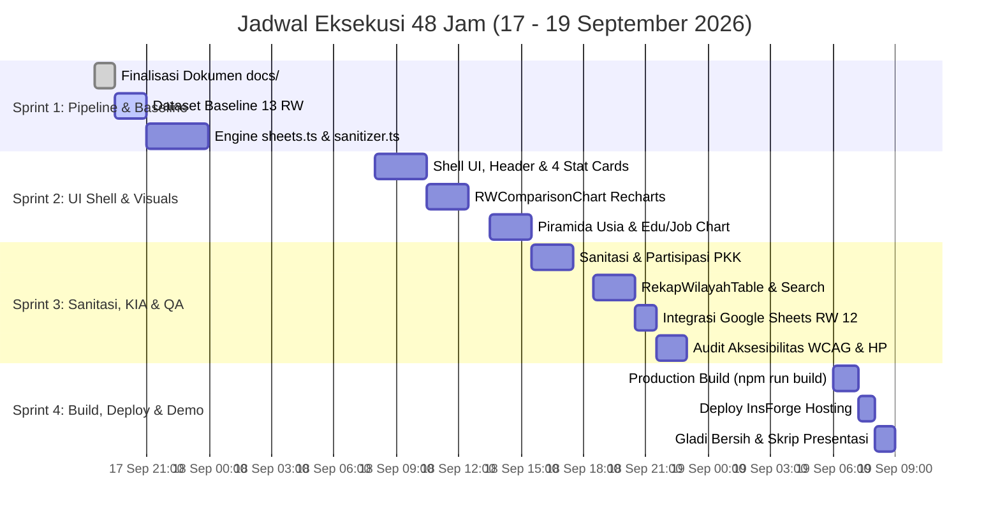

# 48-Hour Solo Engineering Execution Plan
## Roadmap & Milestone Menuju Paparan Resmi Kelurahan – 19 September 2026

- **ID Dokumen:** PLAN-PKK-BBL-2026-05
- **Versi:** 2.0.0 (High-Precision Solo Execution)
- **Status:** Approved for Execution
- **Target Tenggat:** Sabtu, 19 September 2026 (09:00 WIB)
- **Audience Paparan:** Ibu Lurah Bubulak, Ketua TP-PKK, dan Dosen Pembimbing
- **Metodologi:** Test-Driven Baseline, Modular Construction, Zero-Error Production Gate

---

## 1. Timeline Eksekusi 48 Jam (Gantt Chart)

---

## 2. Rincian Pekerjaan Taktis Per Sprint

### Sprint 1: Setup Foundation & Data Pipeline (17 Sep – Malam)
*Tujuan: Memastikan data 13 RW siap dikonsumsi komponen visual dengan proteksi tipe ketat.*
- [x] Tingkatkan standar 5 dokumen arsitektur ke v2.0.0 (`docs/01_PRD.md` s/d `docs/05_ROADMAP.md`).
- [x] Buat file tipe data ketat `src/types/dasawisma.ts` sesuai `03_DATA_MODEL_AND_ERD.md`.
- [x] Susun dataset acuan realistis `src/data/baselineBubulak.ts` (mencakup 13 RW, 50 RT, dan 48 Dasawisma).
- [x] Bangun modul parser `src/lib/sheets.ts` dan `src/lib/sanitizer.ts`:
  - Fetcher CSV dari Google Sheets dengan timeout 5 detik.
  - PapaParse stream parser dengan normalisasi whitespace header.
  - Safe looper untuk mengekstrak anggota keluarga 1–6 Buku 1 tanpa error.
  - Masker NIK (`3271************`).
- [x] Buat inisialisasi InsForge SDK singleton di `src/lib/insforge.ts`.

---

### Sprint 2: Core Layout, KPI Cards & Grafik Kependudukan (18 Sep – Pagi s/d Siang)
*Tujuan: Menyusun struktur visual beranda utama dan visualisasi demografi berstandar tinggi.*
- [x] Implementasi Shell Layout di `src/app/page.tsx` dengan filosofi *Clean Vertical Flow*.
- [x] Bangun komponen `src/components/dashboard/HeaderExecutive.tsx`:
  - Logo resmi Kota Bogor & PKK.
  - Badge waktu pembaruan otomatis (WIB).
  - Tombol sinkronisasi CSV dengan animasi putar halus.
- [x] Bangun `src/components/dashboard/StatCards.tsx` (4 kartu metrik utama dengan ikon Lucide dan rasio kontras AAA).
- [x] Bangun `src/components/dashboard/GlobalFilterBar.tsx` (Dropdown sticky RW 01–13 dan RT, tombol reset).
- [x] Bangun `src/components/dashboard/RWComparisonChart.tsx` (Recharts Grouped Horizontal Bar untuk 13 RW dengan highlight RW 12).
- [x] Bangun `src/components/dashboard/DemographicsChart.tsx` (Piramida penduduk simetris Pria Biru `#2563eb` vs Wanita Pink `#e11d48`).
- [x] Bangun `src/components/dashboard/EducationJobChart.tsx` (Distribusi pendidikan dan mata pencaharian warga).

---

### Sprint 3: Sanitasi, KIA, Tabel Wilayah & QA Aksesibilitas (18 Sep – Sore s/d Malam)
*Tujuan: Merampungkan indikator Buku 2 & 3 serta pengujian ketat di smartphone.*
- [x] Bangun `src/components/dashboard/SanitationSection.tsx`:
  - Progress meter kriteria rumah sehat, MCK septic tank, air minum PDAM/sumur, SPAL, sampah.
  - 3 kartu partisipasi: UP2K, HATINYA PKK/Pekarangan, dan Kerja Bakti.
- [x] Bangun `src/components/dashboard/KiaSection.tsx`:
  - Pemantauan ibu hamil (Resti/KEK), ibu bersalin/nifas, bayi lahir, dan kepemilikan Akta Kelahiran.
  - Catatan mortalitas dengan penanda *Zero Mortality*.
- [x] Bangun `src/components/dashboard/RekapWilayahTable.tsx`:
  - Tabel 13 RW dengan pencarian instan nama RW/RT.
  - Baris tebal **Grand Total** di bagian bawah.
  - Highlight visual warna Emerald pada baris RW 12.
- [x] Hubungkan pipeline data riil Google Sheets respons uji coba RW 12.
- [x] Audit Kualitas & Aksesibilitas:
  - Uji kontras warna WCAG 2.1 AA (rasio &ge; 4.5:1).
  - Verifikasi seluruh area sentuh &ge; 44x44px pada layar smartphone emulasi (360px–420px).
  - Pastikan zero frame drop dan zero heavy blur.

---

### Sprint 4: Build Production, Deploy & Gladi Bersih Demo (19 Sep – Pagi)
*Tujuan: Kesiapan panggung tanpa kompromi.*
- [x] Jalankan verifikasi build: `npm run build` bebas dari lint error dan type error.
- [x] Deploy ke hosting produksi InsForge: `https://r6nu44ke.insforge.site`.
- [x] Verifikasi tautan produksi live via HTTP 200 OK & browser audit.
- [x] Sinkronisasi bersih git commit dan push ke origin/main.
- [x] Siapkan skenario presentasi 10 menit di hadapan Bu Lurah:
  - **Menit 01–02:** Masalah pencatatan manual vs solusi digital terintegrasi.
  - **Menit 03–05:** Demo pengisian cepat kader via Google Form RW 12 & alur masuk data.
  - **Menit 06–08:** Eksplorasi dashboard eksekutif: Piramida penduduk, disparitas sanitasi antar-RW, dan status KIA.
  - **Menit 09–10:** Kesimpulan dan rekomendasi kebijakan kelurahan berbasis data riil.
